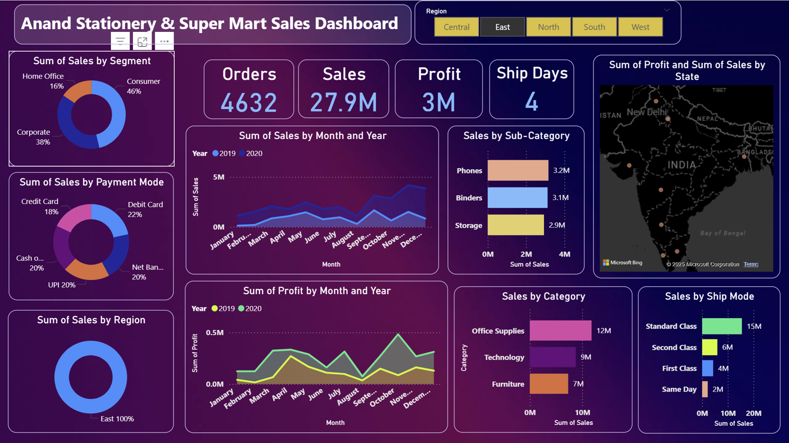
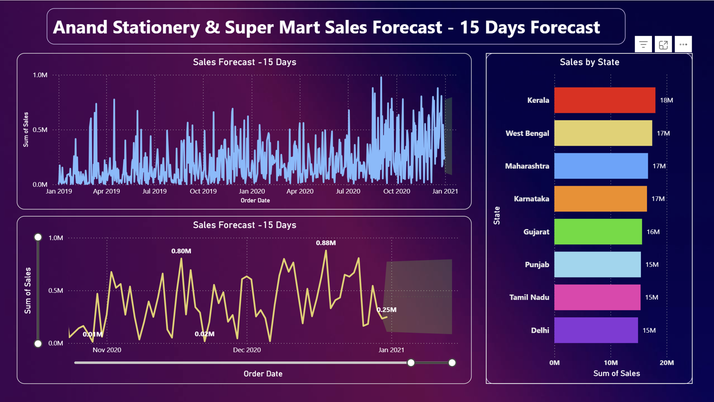
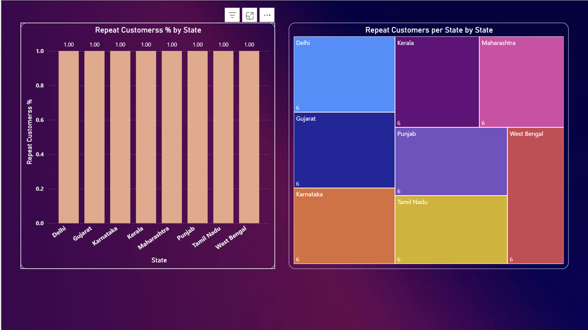

# 🛒 Retail Store Sales Analysis using Power BI

An interactive **Power BI dashboard project** built on retailer store data to analyze sales performance, profitability, customer behavior, and logistics efficiency across India.

---

## 📌 Project Overview

This project transforms raw retail transactional data into **actionable business insights** using Power BI.  
The dashboard supports **data-driven decision making** for sales strategy, regional expansion, and logistics optimization.

---

## 🎯 Objectives

- Analyze **state-wise and category-wise sales**
- Identify **profitable regions & repeat customers**
- Evaluate **logistics delays and shipping efficiency**
- Compare **local vs interstate performance**
- Enable **forecasting for future planning**

---

## 📂 Dataset Description

**Source:** Monthly CSV exports from Tally ERP  
**Coverage:** 20+ Indian states  
**Key Columns:**
- Order ID
- Order Date
- Customer Name
- Category
- Sales
- Quantity
- Discount
- Profit
- Ship Mode
- Ship Days
- City & State

---

## 🔧 Data Processing (Power Query)

- Removed null and duplicate records
- Standardized data types
- Created derived columns:
  - Month
  - Year
  - Region
- Ensured data consistency and validation

---

## 📊 Dashboard Features

### 🔹 Sales Trend Analysis
- Monthly & yearly sales growth visualization

### 🔹 Profit by Region
- State-wise profitability comparison

### 🔹 Category Distribution
- Contribution of product categories to revenue

### 🔹 Geographic Analysis
- Interactive India map for sales distribution

### 🔹 Dynamic Filters
- State
- Category
- Ship Mode

---

## 🧠 DAX Measures Used

```DAX
Total Sales = SUM('SuperStore_India'[Sales])

Profit Margin % =
DIVIDE(
    SUM('SuperStore_India'[Profit]),
    SUM('SuperStore_India'[Sales])
)

Yearly Growth % =
VAR CurrentYearSales = SUM('SuperStore_India'[Sales])
VAR LastYearSales =
    CALCULATE(
        SUM('SuperStore_India'[Sales]),
        SAMEPERIODLASTYEAR('SuperStore_India'[Order Date])
    )
RETURN
DIVIDE(CurrentYearSales - LastYearSales, LastYearSales)

Delayed Orders =
COUNTROWS(
    FILTER(
        'SuperStore_India',
        'SuperStore_India'[Ship Days] > 3
    )
)

```

---

## 📊 Dashboard Screenshots

### Dashboard Overview

**Insight:** Provides a complete view of sales, profit, orders, shipping time, and regional performance across India.

### Sales Forecast (15 Days)

**Insight:** Forecasting indicates upcoming demand trends, helping plan inventory and logistics proactively.

### Repeat Customers by State

**Insight:** Identifies states with high customer retention, enabling targeted loyalty and retention strategies.
